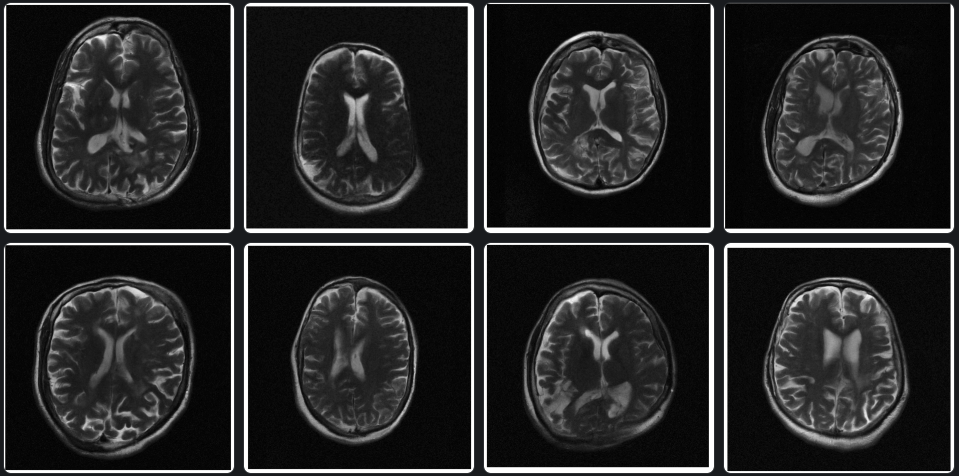

# Generic Score-Based Generative Models Pipeline

by [Asad Aali](http://users.ece.utexas.edu/~jtamir/csilab.html) and [Jon Tamir](http://users.ece.utexas.edu/~jtamir/csilab.html), UT CSI Lab.

This repo contains the official implementation for the paper [Improved Techniques for Training Score-Based Generative Models](http://arxiv.org/abs/2006.09011). 

by [Yang Song](http://yang-song.github.io/) and [Stefano Ermon](https://cs.stanford.edu/~ermon/), Stanford AI Lab.

-----------------------------------------------------------------------------------------

We streamline the method proposed in [Generative Modeling by Estimating Gradients of the Data Distribution](https://arxiv.org/abs/1907.05600). Score-based generative models are flexible neural networks trained to capture the score function of an underlying data distribution—a vector field pointing to directions where the data density increases most rapidly. We present a generic pipeline for training score-based generative models.



(**From left to right**: Our samples on FastMRI 384x384)

## Running Experiments

### Dependencies

Run the following to install all necessary python packages for our code.

```bash
pip install -r requirements.txt
```

### Configuration file structure

`train.py` is the file that you should run for training:

```
Usage:
python score-diffusion-training/train.py --config_path [CONFIG FILE PATH]

Configuration files are kept in `configs/`. Configuration files are structured as:

```bash
├── model # model configurations
│   └── <loss>: specify the loss function to be used for training from losses.py
│   └── <depth>: choose from "low", "medium", "large" to specify NCSNV2 model size, large -> deepest NCSNV2 model
│   └── <gpu>: specify GPU id to run the training on
│   └── <ngf>: number of hidden layers in the model. large values increase model complexity. should range between 32 - 128 based on complexity
│   └── <num_classes>: determines number of sigmas/noise levels to train the model on. a value between 2000-3000 helps train the model on various levels
│   └── <sigma_rate>: controls geometric progression of sigmal levels. if SURE training, can specify function "sigma_rate_sure" for automated calculation
│   └── <get_sigmas>: use "get_sigmas_sure" if SURE training. leave empty otherwise for automated calculation
│   └── "sigma_end": provide a sigma_end value to specify lowest sigma level. leave empty for automated calculation
├── data # dataloader and dataset configurations
│   └── <dataloader>: specify name of the dataloader you have developed
│   └── <file>: name of file or dataset you will be training on
│   └── <path>: path where the dataset is kept
│   └── "noise_std": noise added during training at certain SNR for SURE training
├── training # training configurations
│   └── <batch_size>: batch size used by the dataloader
│   └── <n_epochs>: max # of times training is run on the entire dataset
│   └── <seed>: random seed generator,
│   └── <X_train>: specify the matrix from the dataloader dictionary to train on
```

** Before running training, the highest sigma_level will need to be specified in a .txt file at location `parameters/` with name `config.data.file`.

Models will be saved in `models/`.

## References

```bib
@inproceedings{song2020improved,
  author    = {Yang Song and Stefano Ermon},
  editor    = {Hugo Larochelle and
               Marc'Aurelio Ranzato and
               Raia Hadsell and
               Maria{-}Florina Balcan and
               Hsuan{-}Tien Lin},
  title     = {Improved Techniques for Training Score-Based Generative Models},
  booktitle = {Advances in Neural Information Processing Systems 33: Annual Conference
               on Neural Information Processing Systems 2020, NeurIPS 2020, December
               6-12, 2020, virtual},
  year      = {2020}
}
```

```bib
@inproceedings{song2019generative,
  title={Generative Modeling by Estimating Gradients of the Data Distribution},
  author={Song, Yang and Ermon, Stefano},
  booktitle={Advances in Neural Information Processing Systems},
  pages={11895--11907},
  year={2019}
}
```
